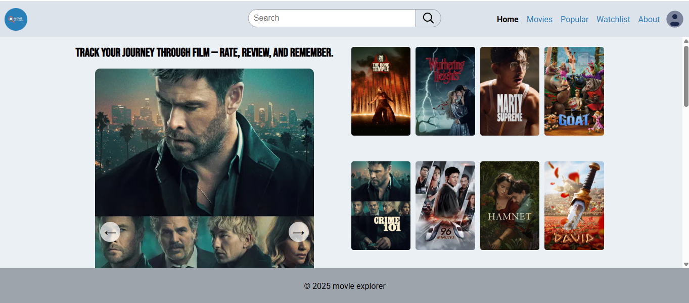
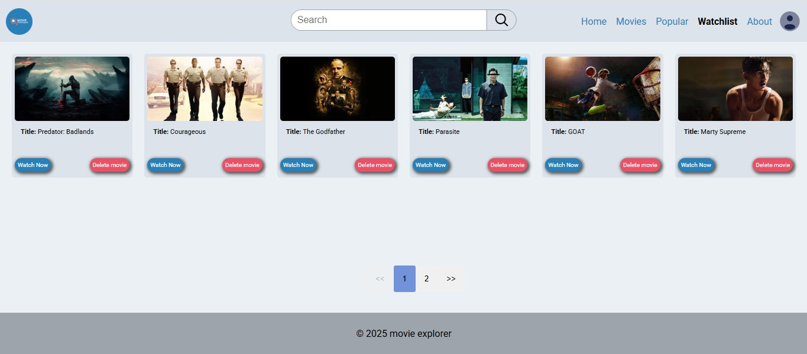

## 📽️ Movie Explorer

**Movie Explorer** is a sleek and responsive web application that allows users to search, explore, and learn more about movies. It fetches data from a public movie API and displays details like ratings, genres, cast, and trailers.

---

### 🌍 Live Demo

Try it here: [Movie Explorer Demo](https://ugo-movie.netlify.app/)

---

### 🚀 Features

- 🔍 Search movies by title or keyword
- 📚 Learn about films with rich details.
- 🌐 Responsive design for mobile and desktop
- 💾 Save and delete movies from Watchlist

---

### 📸 Screenshots

Homepage view:


Watchlist view:


---

### 🛠️ Tech Stack

- **Frontend:** React, React Router
- **Styling:** CSS Modules / Styled Components
- **API:** [The Movie Database (TMDb)](https://www.themoviedb.org/documentation/api)
- **Database:** Cloud Firestore (Firebase)
- **Deployment:** Netlify / GitHub Pages

---

### 📦 Installation

```bash
git clone https://github.com/yourusername/movie-explorer.git
cd movie-explorer
npm install
npm start
```

---

### ⚙️ Configuration

Create a `.env` file in the root directory and add your TMDb API key:

```env
REACT_APP_TMDB_API_KEY=your_api_key_here
```

---

### 📁 Project Structure

```
movie-explorer/
├── public/
├── src/
│   ├── components/
│   ├── pages/
│   ├── services/
│   ├── App.js
│   └── index.js
├── .env
├── package.json
└── README.md
```

---

### 🧪 Testing

```bash
npm test
```

Uses Jest and React Testing Library for unit and integration tests.

---

### 📤 Deployment

To deploy on Netlify:

```bash
npm run build
```

Then drag the `build/` folder into Netlify or connect your GitHub repo.

---

### 📄 License

This project is licensed under the MIT License.

---
